# Database Schema

## Overview

The PostgreSQL layer stores:
- the imported HR dataset in `employees`;
- every API payload sent to the model in `prediction_inputs`;
- every prediction returned by the model in `prediction_outputs`.

This ensures full traceability between the source data, the model input, and the generated prediction.

## ER Diagram

```mermaid
erDiagram
    EMPLOYEES ||--o{ PREDICTION_INPUTS : "matches source employee"
    PREDICTION_INPUTS ||--|| PREDICTION_OUTPUTS : "produces"

    EMPLOYEES {
        int id PK
        int age
        int revenu_mensuel
        int nombre_experiences_precedentes
        int annee_experience_totale
        int annees_dans_l_entreprise
        int annees_dans_le_poste_actuel
        int satisfaction_employee_environnement
        int satisfaction_employee_nature_travail
        int satisfaction_employee_equipe
        int satisfaction_employee_equilibre_pro_perso
        int note_evaluation_precedente
        int note_evaluation_actuelle
        int niveau_hierarchique_poste
        int heure_supplementaires
        float augementation_salaire_precedente
        int nombre_participation_pee
        int nb_formations_suivies
        int distance_domicile_travail
        int niveau_education
        int annees_depuis_la_derniere_promotion
        int annes_sous_responsable_actuel
        string genre
        string statut_marital
        string departement
        string poste
        string domaine_etude
        string frequence_deplacement
        datetime created_at
    }

    PREDICTION_INPUTS {
        int id PK
        int employee_id FK
        int age
        int revenu_mensuel
        int nombre_experiences_precedentes
        int annee_experience_totale
        int annees_dans_l_entreprise
        int annees_dans_le_poste_actuel
        int satisfaction_employee_environnement
        int satisfaction_employee_nature_travail
        int satisfaction_employee_equipe
        int satisfaction_employee_equilibre_pro_perso
        int note_evaluation_precedente
        int note_evaluation_actuelle
        int niveau_hierarchique_poste
        int heure_supplementaires
        float augementation_salaire_precedente
        int nombre_participation_pee
        int nb_formations_suivies
        int distance_domicile_travail
        int niveau_education
        int annees_depuis_la_derniere_promotion
        int annes_sous_responsable_actuel
        string genre
        string statut_marital
        string departement
        string poste
        string domaine_etude
        string frequence_deplacement
        datetime created_at
    }

    PREDICTION_OUTPUTS {
        int id PK
        int prediction_input_id FK
        int prediction
        float probability
        float threshold
        string label
        string model_name
        string model_version
        datetime created_at
    }
```



## Files

- `app/db/database.py`: SQLAlchemy engine, session and dependency injection
- `app/db/models.py`: ORM models
- `app/db/repository.py`: persistence helpers for prediction logs
- `scripts/create_db.py`: creates the database tables
- `scripts/load_dataset.py`: imports the HR dataset into `employees`
- `sql/schema.sql`: SQL version of the schema

## Typical Commands

Create tables:

```bash
python scripts/create_db.py
```

Load the dataset into PostgreSQL:

```bash
python scripts/load_dataset.py --csv-path /path/to/dataset.csv --truncate
```

## Traceability Workflow

1. A dataset row is stored in `employees`.
2. A prediction request sent to `/predict` is stored in `prediction_inputs`.
3. If the payload matches a row already present in `employees`, the API links `prediction_inputs.employee_id` to that source row.
4. The model output is stored in `prediction_outputs`.

This creates a complete audit trail of the ML inference pipeline.
