# Database Schema

## Overview

La couche PostgreSQL layer comprend:
- l'ensemble de données RH importé dans `employees` ;
- chaque charge utile (payload) API envoyée au modèle dans `prediction_inputs` ;
- chaque prédiction renvoyée par le modèle dans `prediction_outputs`.

Cela garantit une traçabilité totale entre les données sources, les entrées du modèle et la prédiction générée.

## ER Diagram

```mermaid
erDiagram
    EMPLOYEES ||--o{ PREDICTION_INPUTS : "matches source employee"
    PREDICTION_INPUTS ||--|| PREDICTION_OUTPUTS : "produces"

    EMPLOYEES {
        int id PK
        int age
        int revenu_mensuel
        int nombre_experiences_precedentes
        int annee_experience_totale
        int annees_dans_l_entreprise
        int annees_dans_le_poste_actuel
        int satisfaction_employee_environnement
        int satisfaction_employee_nature_travail
        int satisfaction_employee_equipe
        int satisfaction_employee_equilibre_pro_perso
        int note_evaluation_precedente
        int note_evaluation_actuelle
        int niveau_hierarchique_poste
        int heure_supplementaires
        float augementation_salaire_precedente
        int nombre_participation_pee
        int nb_formations_suivies
        int distance_domicile_travail
        int niveau_education
        int annees_depuis_la_derniere_promotion
        int annes_sous_responsable_actuel
        string genre
        string statut_marital
        string departement
        string poste
        string domaine_etude
        string frequence_deplacement
        datetime created_at
    }

    PREDICTION_INPUTS {
        int id PK
        int employee_id FK
        int age
        int revenu_mensuel
        int nombre_experiences_precedentes
        int annee_experience_totale
        int annees_dans_l_entreprise
        int annees_dans_le_poste_actuel
        int satisfaction_employee_environnement
        int satisfaction_employee_nature_travail
        int satisfaction_employee_equipe
        int satisfaction_employee_equilibre_pro_perso
        int note_evaluation_precedente
        int note_evaluation_actuelle
        int niveau_hierarchique_poste
        int heure_supplementaires
        float augementation_salaire_precedente
        int nombre_participation_pee
        int nb_formations_suivies
        int distance_domicile_travail
        int niveau_education
        int annees_depuis_la_derniere_promotion
        int annes_sous_responsable_actuel
        string genre
        string statut_marital
        string departement
        string poste
        string domaine_etude
        string frequence_deplacement
        datetime created_at
    }

    PREDICTION_OUTPUTS {
        int id PK
        int prediction_input_id FK
        int prediction
        float probability
        float threshold
        string label
        string model_name
        string model_version
        datetime created_at
    }
```



## Fichiers

- `app/db/database.py`: moteur SQLAlchemy, session et injection de dépendances
- `app/db/models.py`: modèles ORM 
- `app/db/repository.py`: aides à la persistance pour les journaux de prédiction
- `scripts/create_db.py`: crée les tables de la base de données
- `scripts/load_dataset.py`: importe l'ensemble de données RH dans `employees`
- `sql/schema.sql`: version SQL du schéma

## Commandes de lancement

Création des tables:

```bash
python scripts/create_db.py
```

Chargement de l'ensemble de données dans PostgreSQL :

```bash
python scripts/load_dataset.py --csv-path /path/to/dataset.csv --truncate
```

## Flux de travail de traçabilité

1. Une ligne de l'ensemble de données est stockée dans `employees`.
2. Une requête de prédiction envoyée à `/predict` est stockée dans `prediction_inputs`.
3. Si le contenu de la requête correspond à une ligne déjà présente dans `employees`, l'API relie `prediction_inputs.employee_id` à cette ligne source.
4. La sortie du modèle est stockée dans `prediction_outputs`.

Cela crée une piste d'audit complète du pipeline d'inférence ML.
